# Endfield AIC Simulation (v2)

## Old Logic (request flow)

```mermaid
sequenceDiagram
    autonumber
    participant U as Upstream
    participant C as Current
    participant D as Downstream

    rect rgb(30, 50, 80)
        note over U,D: Phase 1: Request Propagation
        U->>C: request (if U wants to send)
        activate C
        C->>C: record upstream
        C->>D: request (if C wants to send)
        activate D
        D->>D: record upstream
        deactivate D
        deactivate C
    end

    rect rgb(30, 80, 50)
        note over U,D: Phase 2: Adjudication (Optional)
        C->>C: select upstream (e.g., Round-Robin)
    end

    rect rgb(80, 50, 30)
        note over U,D: Phase 3: Grant Response
        D->>D: can accept?
        D->>C: grant (if accepted)
        C->>C: can accept? (check self or recurse)
        C->>U: grant (if can accept)
    end

    rect rgb(60, 30, 80)
        note over U,D: Phase 4: Item Transfer
        U->>C: send item
        C->>D: send item (if D granted)
    end

    rect rgb(50, 50, 50)
        note over U,D: Phase 5: Commit & Reset
        U->>U: update state
        C->>C: shift items, accept input, reset flags
        D->>D: collect item, reset flags
    end
```



## Design Ideas

### CACHE

Components are finite state machines. Cache their reachable states so transitions can be applied directly on a hit.

### BFS Request Propagation / DFS Rollback

1. Previously, only components that **met send conditions** initiated requests. Now requests propagate via BFS through the entire belt chain (including empty segments).
2. Precompute a topological sort of the graph with damping weights. During DFS, always prefer the lowest-damping path first; roll back on blockage.

### Components Pool

- Every component has a unique position `(x, y)` in the map.
- Unify the Packet structure to reduce size and serialization overhead.
- Decouple component communication via async non-blocking message passing.
- Additional communication-layer optimizations.

## Direction Reference (Canvas-aligned)

The coordinate system matches Canvas pixel space: **+x is right, +y is down**.

| Direction | Vector | Description |
|-----------|--------|-------------|
| `UP` | `(0, -1)` | Negative y (screen up) |
| `DOWN` | `(0, +1)` | Positive y (screen down) |
| `LEFT` | `(-1, 0)` | Negative x (screen left) |
| `RIGHT` | `(+1, 0)` | Positive x (screen right) |

This eliminates y-flip in the renderer. All Direction ↔ Rotation math uses 90° clockwise increments.

## Two-Phase Tick Loop

Two passes per tick, using the topologically-sorted graph order:

```python
for coord in reversed(graph.order):   # Phase 1: sinks → sources
    comp.phase1()                      #   fulfil_requests() + request_upstream()

for coord in graph.order:             # Phase 2: sources → sinks
    comp.phase2()                      #   forward zero-tick passthrough (no-op by default)
```

**Phase 1** (reverse order, sinks first):  
Each component fulfils pending pull requests (hands items downstream) then requests new items from upstream.

**Phase 2** (forward order, sources first):  
Components that received items in Phase 1 can forward them in the same tick (zero-tick passthrough). The `Base` default is no-op; `ProtocolStash` overrides this with immediate downstream forwarding.

## Bilateral Port Matching

Connections require a **compatible counter-port** on the target component. If component A has an OUTPUT pointing at component B, B must have an INPUT pointing back at A for the link to be created. This prevents one-way connections (e.g. unloader → unloader).

The check (`_has_compatible_counterpart` in `graph.py`):
1.  Finds the target component at the port's direction neighbour.
2.  Iterates the target's ports, looking for the opposite `LinkType`.
3.  Verifies the counter-port's target cell falls within our occupied cells.

## Conveyor JSON Format

Conveyors use **path-based placement** instead of `pos`/`rot`:

```json
{
    "type": "conveyor",
    "path": [[0, 0], [2, 0], [2, 1]],
    "direction_in": "up",
    "direction_out": "down"
}
```

| Field | Required | Description |
|-------|----------|-------------|
| `path` | ✓ | Polyline waypoints; expanded into cell-by-cell offsets |
| `direction_in` | ✓ | Direction the input port faces (must point toward upstream) |
| `direction_out` | ✓ | Direction the output port faces (must point toward downstream) |

The origin is `path[0]`; `pos` and `rot` are ignored.

## Additional Components

| Component | Inputs | Outputs | Behaviour |
|-----------|--------|---------|-----------|
| `ProtocolStash` | ≥1 | ≥1 | Single-slot buffer + Inventory(6×50). Zero-tick passthrough: if a downstream can accept, items skip the buffer entirely. Round-robin downstream selection. |

## Frontend

A web-based simulation viewer lives in `frontend/`.

| Layer | Files |
|-------|-------|
| **Backend** | `frontend/server.py` — FastAPI serving REST API at `/api/*` |
| **Frontend** | `frontend/static/ts/` — TypeScript → compiled JS, canvas-based viewer |
| **API endpoints** | `/api/cases`, `/api/component_types`, `/api/load`, `/api/layout`, `/api/tick`, `/api/reset` |

See `frontend/README.md` for setup and architecture details.

## Developer Quick Reference

| Command | Action |
|---|---|
| `uv sync` | Install Python deps |
| `uv run mypy .` | Static type checking |
| `uv run pytest` | Run all tests |
| `uv run pytest -k test_name` | Run a single test |
| `uv run python frontend/server.py` | Start FastAPI dev server |
| `cd frontend && npm run build` | Compile TypeScript → JS |
| `uv run pdoc simulation -o docs` | Regenerate API docs |
