# Endfield AIC Simulation (v2)

## Request Flow



```mermaid
sequenceDiagram
    autonumber
    participant U as Upstream
    participant C as Current
    participant D as Downstream

    rect rgb(30, 50, 80)
        note over U,D: Phase 1: Request Propagation
        U->>C: request (if U wants to send)
        activate C
        C->>C: record upstream
        C->>D: request (if C wants to send)
        activate D
        D->>D: record upstream
        deactivate D
        deactivate C
    end

    rect rgb(30, 80, 50)
        note over U,D: Phase 2: Adjudication (Optional)
        C->>C: select upstream (e.g., Round-Robin)
    end

    rect rgb(80, 50, 30)
        note over U,D: Phase 3: Grant Response
        D->>D: can accept?
        D->>C: grant (if accepted)
        C->>C: can accept? (check self or recurse)
        C->>U: grant (if can accept)
    end

    rect rgb(60, 30, 80)
        note over U,D: Phase 4: Item Transfer
        U->>C: send item
        C->>D: send item (if D granted)
    end

    rect rgb(50, 50, 50)
        note over U,D: Phase 5: Commit & Reset
        U->>U: update state
        C->>C: shift items, accept input, reset flags
        D->>D: collect item, reset flags
    end
```

## Design Ideas

### CACHE

Components are finite state machines. Cache their reachable states so transitions can be applied directly on a hit.

### BFS Request Propagation / DFS Rollback

1. Previously, only components that **met send conditions** initiated requests. Now requests propagate via BFS through the entire belt chain (including empty segments).
2. Precompute a topological sort of the graph with damping weights. During DFS, always prefer the lowest-damping path first; roll back on blockage.

### Components Pool

- Every component has a unique position `(x, y)` in the map.
- Unify the Packet structure to reduce size and serialization overhead.
- Decouple component communication via async non-blocking message passing.
- Additional communication-layer optimizations.

## Rotation / Direction Reference

| Rotation | Description |
| --- | --- |
| `ROT_0` | No rotation |
| `ROT_1` | Clockwise 90° |
| `ROT_2` | Clockwise 180° |
| `ROT_3` | Clockwise 270° |

```plaintext
(0, 0)
 +-x-(+1, 0)-------> x
 |   x (+2, +1)
 |     x (+3, +2)
 |       x (+4, +3)
 |
 |
 |
 |
 v
 y
```

| Direction | Description |
| --- | --- |
| `RIGHT` | Facing right of local +y, `(-1, 0)` |
| `LEFT` | Facing left of local +y, `(+1, 0)` |
| `UP` | Facing forward along local +y, `(0, +1)` |
| `DOWN` | Facing backward along local +y, `(0, -1)` |
