```mermaid
sequenceDiagram
    autonumber
    participant U as Upstream
    participant C as Current
    participant D as Downstream

    rect rgb(30, 50, 80)
        note over U,D: Phase 1: Request Propagation
        U->>C: request (if U wants to send)
        activate C
        C->>C: record upstream
        C->>D: request (if C wants to send)
        activate D
        D->>D: record upstream
        deactivate D
        deactivate C
    end

    rect rgb(30, 80, 50)
        note over U,D: Phase 2: Adjudication (Optional)
        C->>C: select upstream (e.g., Round-Robin)
    end

    rect rgb(80, 50, 30)
        note over U,D: Phase 3: Grant Response
        D->>D: can accept?
        D->>C: grant (if accepted)
        C->>C: can accept? (check self or recurse)
        C->>U: grant (if can accept)
    end

    rect rgb(60, 30, 80)
        note over U,D: Phase 4: Item Transfer
        U->>C: send item
        C->>D: send item (if D granted)
    end

    rect rgb(50, 50, 50)
        note over U,D: Phase 5: Commit & Reset
        U->>U: update state
        C->>C: shift items, accept input, reset flags
        D->>D: collect item, reset flags
    end
```

# Endfield AIC Simulation (v2)

## 原先结构

## 主要想法

### CACHE

由于每个组件都是有限状态机，我们可以对组件的模式进行缓存，如果命中直接做状态转移

### BFS 广搜请求 / DFS 路径回退

1. 原先采用遍历部件的方式处理请求，且只有**满足发送条件**的 component 发送请求。现在我们让请求通过 BFS 从头开始穿过整个传送带链条（包括空的 components）。
2. 可以预先对整个图进行拓扑排序，记录阻尼；在 DFS 时总是优先选择阻尼最短的路径，如果发生阻塞再考虑回退。

### Components Pool

- 将所有 Component 赋予一个唯一的位置信息（如在地图中所在的坐标 `(x, y)`）
- 统一 Packet 结构，减少数据大小和序列化开销；
- 解耦组件通信，实现异步非阻塞的消息传递。
- 其他通信方面的优化# endfield-AIC-simulation-v2
