# Endfield AIC Simulation (v2)

## Request Flow



```mermaid
sequenceDiagram
    autonumber
    participant U as Upstream
    participant C as Current
    participant D as Downstream

    rect rgb(30, 50, 80)
        note over U,D: Phase 1: Request Propagation
        U->>C: request (if U wants to send)
        activate C
        C->>C: record upstream
        C->>D: request (if C wants to send)
        activate D
        D->>D: record upstream
        deactivate D
        deactivate C
    end

    rect rgb(30, 80, 50)
        note over U,D: Phase 2: Adjudication (Optional)
        C->>C: select upstream (e.g., Round-Robin)
    end

    rect rgb(80, 50, 30)
        note over U,D: Phase 3: Grant Response
        D->>D: can accept?
        D->>C: grant (if accepted)
        C->>C: can accept? (check self or recurse)
        C->>U: grant (if can accept)
    end

    rect rgb(60, 30, 80)
        note over U,D: Phase 4: Item Transfer
        U->>C: send item
        C->>D: send item (if D granted)
    end

    rect rgb(50, 50, 50)
        note over U,D: Phase 5: Commit & Reset
        U->>U: update state
        C->>C: shift items, accept input, reset flags
        D->>D: collect item, reset flags
    end
```

## Design Ideas

### CACHE

Components are finite state machines. Cache their reachable states so transitions can be applied directly on a hit.

### BFS Request Propagation / DFS Rollback

1. Previously, only components that **met send conditions** initiated requests. Now requests propagate via BFS through the entire belt chain (including empty segments).
2. Precompute a topological sort of the graph with damping weights. During DFS, always prefer the lowest-damping path first; roll back on blockage.

### Components Pool

- Every component has a unique position `(x, y)` in the map.
- Unify the Packet structure to reduce size and serialization overhead.
- Decouple component communication via async non-blocking message passing.
- Additional communication-layer optimizations.

## Rotation / Direction Reference

| Rotation | Description |
| --- | --- |
| `ROT_0` | No rotation |
| `ROT_1` | Clockwise 90° |
| `ROT_2` | Clockwise 180° |
| `ROT_3` | Clockwise 270° |

```plaintext
(0, 0)
 +-x-(+1, 0)-------> x
 |   x (+2, +1)
 |     x (+3, +2)
 |       x (+4, +3)
 |
 |
 |
 |
 v
 y
```

| Direction | Description |
| --- | --- |
| `RIGHT` | Facing right of local +y, `(-1, 0)` |
| `LEFT` | Facing left of local +y, `(+1, 0)` |
| `UP` | Facing forward along local +y, `(0, +1)` |
| `DOWN` | Facing backward along local +y, `(0, -1)` |

## Implementation

### Commands

```bash
uv sync                        # install deps
uv run mypy .                  # static type check
uv run pytest -v               # run tests
uv run python tools/runner.py --all --render type   # run all JSON test cases
uv run python tools/runner.py tests/test_cases/belt_line.json  # single case
```

### Project Structure (v3)

```
simulation/
├── _enums.py        Direction, Rotation, ComponentType, LinkType
├── _types.py        Coverage, RelativeOffset type aliases
├── _id_gen.py       IDGen — monotonic ID allocator
├── factory.py       Factory — builds Layout + Graph from JSON config
├── layout.py        Layout — grid occupancy, overlap detection
├── graph.py         Graph — port-based connections, Kahn topological sort, tick
├── mappings.py      Metadata lookup (coverage, ports), component factory
├── items/
│   ├── item.py      Item (id + type)
│   ├── itemstack.py ItemStack (typed stack with capacity)
│   └── inventory.py Inventory (slot array, push/pop by type, defaults prefill)
├── units/
│   ├── base.py      Base(ABC) — upstreams/downstreams, pull_requests, tick hooks
│   ├── depot_access/  DepotLoader(sink→inv), DepotUnloader(source→inv), ProtocolStash
│   └── logistics_units/belt/  Conveyor, Splitter, Converger, BeltBridge, ItemControlPort
└── utils/
    ├── vec.py       Vec(x, y) with rotate/towards, __hash__/__eq__
    └── area.py      Area coverage rectangle
assets/unit_metadata.json
tests/
├── _view.py              Belt rendering helpers
├── test_cases/*.json     JSON test case definitions
└── test_conveyor.py      pytest test suite
tools/
└── runner.py        CLI runner using Factory + tests._view
```

### Tick Loop

Single-pass reverse-topological traversal (pull model):

```
for coord in reversed(graph.order):   # sinks → sources
    comp.fulfill_requests()            # give items to downstream pullers
    comp.request_upstream()            # register pull on upstream, advance ptr
```

Components are auto-connected via port direction matching + rotation. No manual wiring.

### Components

| Component | Inputs | Outputs | Behavior |
|-----------|--------|---------|----------|
| Conveyor | 1 max | 1 max | Circular buffer, length param, ptr advances each tick |
| DepotLoader | 0 | ≥1 | Pop items from global Inventory by type |
| DepotUnloader | ≥1 | 0 | Push received items to global Inventory |
| Splitter | 1 | 3 | Distribute to multiple outputs |
| Converger | 3 | 1 | Merge from multiple inputs |

### Conveyor Internals

```
_slots: List[Optional[Item]]     fixed-length circular buffer
_ptr: int                         write position, +1 per tick
_count: int                       current item count

fulfill_requests():  tail = (_ptr - _count + L) % L, pop → downstream
request_upstream():  if space → upstream.add_pull(self); _ptr += 1
_accept_item(item):  slot = (_ptr - 1 + L) % L, place item

get_snapshot() → tail→head linear order (for rendering)
```

### JSON Test Case Format

```json
{
    "name": "Loader Belt Unloader",
    "ticks": 20,
    "inventory": { "ore": 9999 },
    "components": [
        { "pos": [0, 0], "type": "depot_loader",  "rot": "ROT_0", "item": "ore" },
        { "pos": [0, 1], "type": "conveyor",       "rot": "ROT_0", "length": 4 },
        { "pos": [0, 5], "type": "depot_unloader", "rot": "ROT_0" }
    ]
}
```
