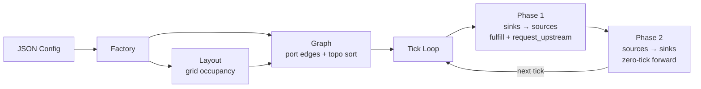
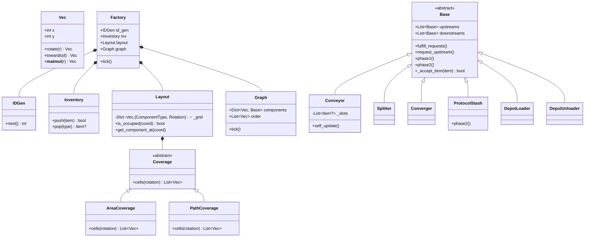

# Endfield AIC Simulation (v2)

Grid-based factory simulation with a two-phase tick loop, bilateral port matching,
and a web-based canvas viewer.

---

## TODO — 实验现象复现记录

- [x] **普通优先级** — 复现成功
- [x] **部分环** — 复现成功
- [ ] **环的手性** — 暂未复现，但（也许）能提供解释
- [ ] **分流器-汇流器紧贴时的优先级** — 部分解释
- [ ] **放置顺序带来的影响** — 部分复现，但结果非常神秘

---

## Pipeline Overview



---

## Architecture



### Key Classes

| Class | Role |
|-------|------|
| `Vec(x, y)` | 2-D integer coordinate; `rotate(r)`, `towards(d)`, `@` operator, iterable as `(x, y)` |
| `Coverage` | Abstract footprint — `cells(rotation)` returns cell offsets |
| `AreaCoverage(w, h)` | Rectangular coverage |
| `PathCoverage(waypoints)` | Polyline coverage (conveyors) |
| `Layout` | Occupancy grid; detects overlap at init |
| `Graph` | Port-matching edge builder + Kahn topological sort |
| `Factory` | Top-level assembler; owns IDGen, Inventory, Layout, Graph |
| `Base` | Abstract component with upstream/downstream links and RR pull-request system |
| `IDGen` | Monotonic integer allocator |
| `Inventory` | Fixed-slot item storage with push/pop by type |

### Pipeline Flow

```
JSON config  →  Factory._parse()  →  Layout (grid occupancy check)
                                  →  Graph (three-pass construction)
                                       1. Instantiate components, build cell map
                                       2. Bilateral port matching → edges
                                       3. Kahn topological sort → order
                                  →  Tick loop
```

---

## Two-Phase Tick Loop

Two passes per tick, using the topologically-sorted graph order
(sinks-first from Kahn's algorithm):

```python
for coord in self.order:                # Phase 1: sinks → sources
    self.components[coord].phase1()     #   fulfill_requests()
                                        #   self_update()
                                        #   request_upstream()

for coord in reversed(self.order):      # Phase 2: sources → sinks
    self.components[coord].phase2()     #   zero-tick forwarding
```



```mermaid
sequenceDiagram
    participant Sink as Sink (downstream)
    participant Mid as Mid
    participant Src as Source (upstream)

    rect rgb(40, 60, 90)
        note over Sink,Src: Phase 1 (sinks → sources)
        Sink->>Sink: fulfill_requests()
        Sink->>Sink: self_update()
        Sink->>Mid: request_upstream()
        Mid->>Mid: fulfill_requests()
        Mid->>Mid: self_update()
        Mid->>Src: request_upstream()
        Src->>Src: fulfill_requests()
        Src->>Src: request_upstream()
    end

    rect rgb(40, 80, 60)
        note over Sink,Src: Phase 2 (sources → sinks)
        Src->>Src: phase2() — zero-tick forward
        Mid->>Mid: phase2()
        Sink->>Sink: phase2()
    end
```

**Phase 1** — Each component:
1. Fulfils pending pull requests (hands items downstream).
2. Advances internal state (conveyors shift items one slot toward exit).
3. Requests new items from upstream if space is available.

**Phase 2** — Forward pass for zero-tick passthrough:
- `Base` default is no-op.
- `ProtocolStash` overrides this to route buffered items to downstreams in the same tick.

---

## Component Wiring (Bilateral Port Matching)

Connections are **not** manually wired. The `Graph` constructor infers edges
by matching ports via direction + rotation:

1. For each port on each component, project outward one cell in the port's
   world direction.
2. If that cell belongs to another component, check that the target has a
   **compatible counter-port** facing back toward us.
3. Only create the edge when a bilateral match is found — prevents one-way
   connections (e.g. unloader → unloader).

```python
# graph.py — simplified
for port_type, port_offset, port_dir in ports:
    world_offset = port_offset @ rotation
    world_dir = port_dir @ rotation
    target = (coord + world_offset).towards(world_dir)
    if _has_compatible_counterpart(target, our_port_type, ...):
        create_edge(coord, target_origin, port_type)
```

Components auto-connect when placed adjacent with compatible port directions.
No manual wiring is needed.

---

## Conveyor JSON Format

Conveyors use **path-based placement** instead of `pos`/`rot`:

```json
{
    "type": "conveyor",
    "path": [[0, 0], [2, 0], [2, 1]],
    "direction_in": "up",
    "direction_out": "down"
}
```

| Field | Required | Description |
|-------|----------|-------------|
| `path` | ✓ | Polyline waypoints; expanded into cell-by-cell offsets |
| `direction_in` | ✓ | Direction the input port faces (must point toward upstream) |
| `direction_out` | ✓ | Direction the output port faces (must point toward downstream) |

The origin is `path[0]`; `pos` and `rot` are ignored.

Belt segments advance items **exactly one slot per tick** toward the exit
(index 0). When the exit is blocked, items queue behind it by one slot
each tick.

---

## Component Reference

### Belt Components (implemented)

| Component | Inputs | Outputs | Behaviour |
|-----------|--------|---------|-----------|
| `Conveyor` | 1 | 1 | Fixed-length slot array; items shift one slot/tick; FIFO; only one downstream allowed |
| `Splitter` | 1 | N | Single-slot buffer; round-robin distribution across downstreams |
| `Converger` | N | 1 | Single-slot buffer; RR selection across upstreams; pull from first that `can_pull()` |
| `ProtocolStash` | ≥1 | ≥1 | Buffer + Inventory(6×50). Zero-tick passthrough: items skip the buffer if a downstream can accept immediately. Short-path-first + RR downstream selection |
| `BeltBridge` | stub | stub | Not implemented — rejects all items |
| `ItemControlPort` | stub | stub | Not implemented — rejects all items |

### Depot Access

| Component | Behaviour |
|-----------|-----------|
| `DepotLoader` | Pulls items of a fixed type from a shared global inventory; pushes downstream on request |
| `DepotUnloader` | Receives items and stores them into a shared global inventory |

### Stubs (not implemented)

All pipe, power, and production units are empty placeholders:

- `Pipe`, `PipeBridge`, `PipeConverger`, `PipeSplitter`, `PipeControlPort`
- `ThermalBank`
- All 14 production units (Crucible, Filling, Fitting, etc.)

---

## Coordinate System

Canvas-aligned: **+x is right, +y is down**.

### Directions

| Direction | Vector | Description |
|-----------|--------|-------------|
| `UP` | `(0, -1)` | Negative y (screen up) |
| `DOWN` | `(0, +1)` | Positive y (screen down) |
| `LEFT` | `(-1, 0)` | Negative x (screen left) |
| `RIGHT` | `(+1, 0)` | Positive x (screen right) |

### Rotations

| Rotation | Description |
|----------|-------------|
| `ROT_0` | No rotation (0°) |
| `ROT_1` | 90° clockwise |
| `ROT_2` | 180° clockwise |
| `ROT_3` | 270° clockwise |

All direction ↔ rotation math uses 90° clockwise increments.
The `@` operator composes rotations and rotates directions.

---

## Frontend

A web-based simulation viewer lives in `frontend/`.

```
index.html  →  static/ts/*.ts  (compiled to static/js/*.js)  →  Canvas 2D rendering
                        ↕ REST API (JSON)
server.py  ←→  simulation package (Factory, Graph, tick)
```

| Layer | Technology |
|-------|------------|
| Backend | `frontend/server.py` — FastAPI |
| Frontend | `frontend/static/ts/` — TypeScript → Canvas 2D |
| API | `/api/cases`, `/api/component_types`, `/api/load`, `/api/layout`, `/api/tick`, `/api/reset`, `/api/blank`, `/api/save`, `/api/load-blueprint` |

See `frontend/README.md` for setup details and module documentation.

---

## Quick Start

```bash
uv sync                          # Install Python dependencies
uv run pytest                    # Run all tests
uv run mypy .                    # Static type checking
uv run python frontend/server.py # Start dev server at http://127.0.0.1:8000

pwsh server.ps1                  # One-shot: build TS + start server
cd frontend && npm install       # Install frontend deps
cd frontend && npm run build     # Compile TypeScript → JS
```

### Tools

```bash
uv run python tools/runner.py tests/test_cases/belt_line.json        # Run a single JSON case
uv run python tools/runner.py --all --render type                    # Run all cases with visual output
uv run python tools/visualize.py                                     # Text + graphviz SVG
uv run python tools/visualize.py --no-graphviz                       # Text-only graph dump
uv run pdoc simulation -o docs                                       # Regenerate API docs
```

### Test Cases

JSON test cases in `tests/test_cases/` are loaded via `Factory(config)` and
stepped for the configured number of ticks:

| Case | Description |
|------|-------------|
| `belt_line.json` | Loader → Conveyor → Unloader |
| `belt_turn.json` | L-shaped conveyor path |
| `belt_accumulate.json` | Belt with accumulation |
| `splitter_line.json` | 1-to-2 splitter distribution |
| `converger_line.json` | 2-to-1 merge |
| `loader_unloader.json` | Direct loader → unloader |
| `protocol_stash.json` | Stash with zero-tick passthrough |
| `protocol_stash_two_inputs.json` | Stash with two input lines |

Blueprints (editable layouts from the frontend) live in `tests/blueprints/`.

---

## Key Quirks

- **Conveyors use path-based placement**: JSON requires `path`, `direction_in`,
  `direction_out` instead of `pos`/`rot`.
- **`mappings.py` loads JSON relative to CWD**: works from repo root
  (`uv run`); fails if CWD differs.
- **Only belt component implementations exist**: `Conveyor`, `Splitter`,
  `Converger`, `BeltBridge`, `ItemControlPort`. All pipe, power, and
  production units are stubs.
- **`docs/` is pdoc-generated**: rebuild with `pdoc simulation -o docs`
  after API changes.
- **`assets/` directory** (not `assests/`).
- **Python 3.13**, `match`/`case` throughout; classes inherit from `object`
  explicitly; relative imports within `simulation` package.
