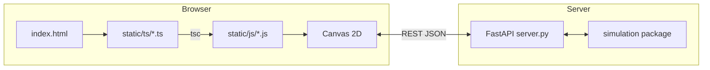
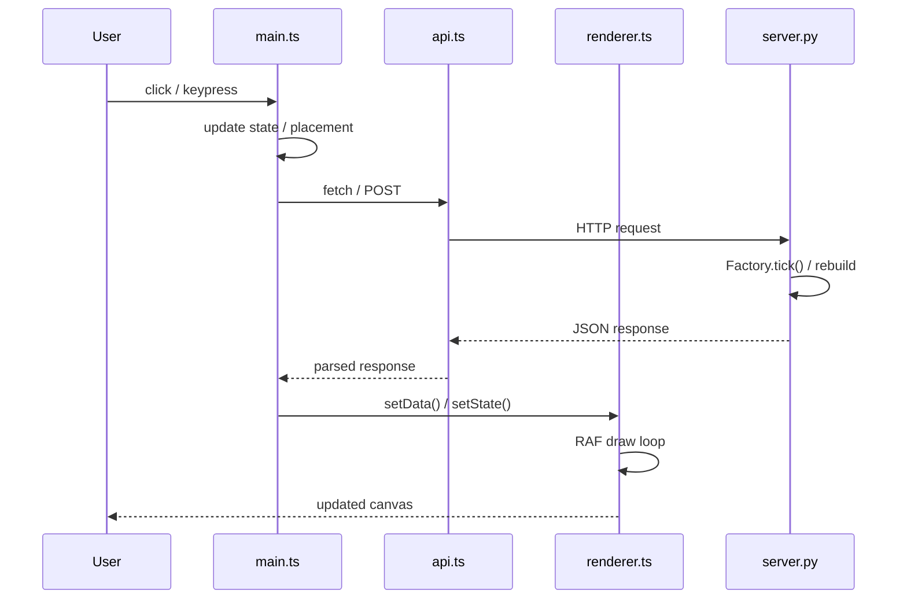
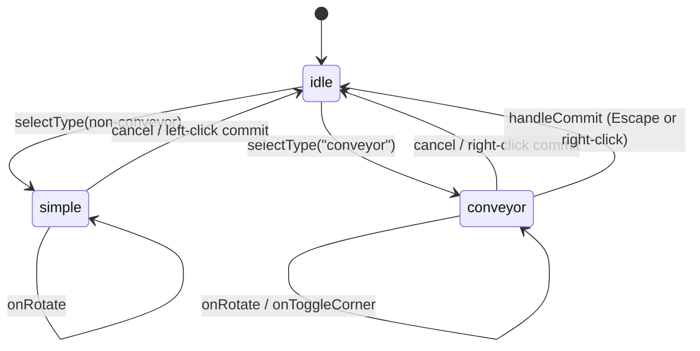

# simulation-v2 Frontend

Web-based simulation viewer with a Canvas 2D rendering engine and FastAPI backend.

---

## Quick Start

```bash
cd frontend
npm install            # install TypeScript
npm run build          # compile TS → static/js/
cd ..
uv run python frontend/server.py   # start at http://127.0.0.1:8000
```

---

## Architecture

### Deployment



### Data Flow



---

## UI Overview

```
┌─────────────────────────────────────────────────────┐
│ [▶ Play] [⏭ Step] [↺ Reset]  Speed: [=====] 1x   │  ← Top bar
│                                   Info: Tick 5 ... │
├──────────┬──────────────────────────────────────────┤
│ Palette  │                                          │
│          │              Canvas                      │
│ [Loader] │         (grid + components               │
│ [Unload] │          + ghost overlay)                │
│ [Stash]  │                                          │
│ [Belt]   │                                          │
│ [Split]  │                                          │
│ [Convg]  │                                          │
│          │                                          │
│ Inventory│                                          │
│ ore: 9999│                                          │
│ [+ Add]  │                                          │
└──────────┴──────────────────────────────────────────┘
```

---

## TypeScript Modules

| File | Role |
|------|------|
| `types.ts` | All shared interfaces and type aliases |
| `api.ts` | REST wrappers — every backend endpoint has a corresponding function |
| `renderer.ts` | Canvas drawing engine (persistent RAF loop), pan/zoom, animation |
| `placement.ts` | Placement state machine — `idle` / `simple` / `conveyor` modes |
| `palette.ts` | Sidebar UI — component list, inventory editor |
| `main.ts` | App initialisation, event handlers, auto-play loop, glue logic |

---

### `types.ts`

Core data types shared between the frontend and backend:

| Type | Description |
|------|-------------|
| `Vec2` | Integer 2-D coordinate `{x, y}` |
| `Rotation` | `"ROT_0"` \| `"ROT_1"` \| `"ROT_2"` \| `"ROT_3"` |
| `PortInfo` | Port descriptor `{type, cell, dir}` |
| `LayoutComponent` | Full component layout data from backend |
| `Edge` | Directed edge `{from, to}` |
| `Viewport` | Visible bounds `{x0, y0, w, h}` |
| `ItemRef` | Item reference `{type, id}` |
| `ComponentState` | Per-component dynamic state per tick |
| `TickState` | `{tick, components[]}` |
| `LayoutResponse` | Combined layout + initial state response |
| `PaletteItem` | Palette metadata from `/api/component_types` |
| `Placement` | Frontend editing state for one component |
| `PlacementMode` | State machine discriminator |
| `GhostData` | Placement preview data for renderer |

---

### `api.ts`

Every backend endpoint has a wrapper:

| Function | Endpoint | Returns |
|----------|----------|---------|
| `fetchCases()` | `GET /api/cases` | `string[]` |
| `fetchComponentTypes()` | `GET /api/component_types` | `PaletteItem[]` |
| `loadCase(name)` | `POST /api/load` | `LayoutResponse` |
| `fetchBlank()` | `POST /api/blank` | `LayoutResponse` |
| `sendLayout(placements, inventory)` | `POST /api/layout` | `LayoutResponse` |
| `saveBlueprint()` | `GET /api/save` | `object[]` |
| `loadBlueprint(data)` | `POST /api/load-blueprint` | `LayoutResponse` |
| `tick(n)` | `POST /api/tick` | `{ok, tick, components}` |
| `resetSim()` | `POST /api/reset` | `{ok, tick, components}` |

All functions return a `Promise` — the caller handles errors.

---

### `renderer.ts`

Canvas drawing engine with a persistent `requestAnimationFrame` loop.

#### Drawing Pipeline (top to bottom)

```
draw() ← RAF loop
├── drawGrid()        — background fill + grid lines (dynamic visible range)
├── drawEdges()       — directed arrowed lines between component centres
├── drawComponents()  — per-component:
│   ├── drawComponentCell()  — cell fills, outlines, label, port arrows
│   └── drawItems()          — animated slot_map / buffer items
└── drawGhost()       — placement preview overlay
    ├── ghost cells + borders
    ├── path polyline (dashed unconfirmed / solid confirmed)
    ├── alt path polyline (corner preview)
    ├── component port arrows
    └── conveyor direction arrows (green = input, red = output)
```

#### Animation Model

- **Persistent RAF**: `init()` starts an infinite `requestAnimationFrame` → `draw()` cycle.
- **Timer-based interpolation**: each `setState()` call records `animStartTime`.
  Progress = `(now - startTime) / duration`.
- **Duration control**: `setAnimDuration(ms)` sets the interpolation window.
  `0` = snap immediately (used for initial load and reset).
- **Item animation**: `slot_map` keys are `"x,y"` strings. Items are matched
  across ticks by `id`. Entering items slide from the `direction_in` side;
  leaving items slide toward the `direction_out` side.

#### Pan / Zoom

| Function | Description |
|----------|-------------|
| `pan(dx, dy)` | Drag view by delta |
| `handleWheel(deltaY, cx, cy)` | Zoom toward fixed screen point |
| `resetView()` | Reset to default (0, 0, zoom=1) |
| `screenToCell(sx, sy)` | Screen pixel → grid cell coordinate |

---

### `placement.ts`

Placement state machine handling clicks, hover, rotation, and conveyor path building.

#### State Machine



#### Conveyor Path Building

Conveyors use a multi-click workflow:

1. **First click** — places the start waypoint.
2. **Subsequent clicks** — extend the path. Diagonal clicks auto-insert a
   corner waypoint.
3. **R key** — cycles `direction_in` (before first click) or `direction_out`
   (after), respecting forbidden directions.
4. **Tab key** — toggles between two corner solutions for diagonal segments.
5. **Right-click / Escape** — commit the path and add it to the placement list.

**Direction constraints**: The first segment direction must **not** equal
`direction_in` (would extend into the entry direction). The last segment
direction must **not** equal the opposite of `direction_out`. These are
enforced by `firstSegAllowed()` and `forbiddenDirs()`.

---

### `palette.ts`

Sidebar UI for component selection and inventory editing.

| Function | Description |
|----------|-------------|
| `init(el, cb, invCb)` | Bind to DOM container and callbacks |
| `setPaletteItems(list)` | Populate component list from backend metadata |
| `setInventoryData(data)` | Set initial inventory values |
| `getSelectedType()` | Currently selected component type |
| `getSelectedItemType()` | Configured item type (for `depot_loader`) |
| `clearSelection()` | Deselect and re-render |
| `setSelectedType(t)` | Programmatic selection |
| `buildPlacement(pos, rot)` | Create a `Placement` for the selected type |

---

### `main.ts`

App bootstrap, event wiring, and the auto-play loop.

#### Auto-Play Loop

```
keepAutoPlaying()
  └→ tick(1)
  └→ setState() → animStartTime = now
  └→ await setTimeout(interval - elapsed)
  └→ repeat
```

The speed slider maps 1x–10x to a tick interval of 2000ms–200ms.
The slider uses a two-stage update (`input`/`change`) for smooth
preview without race conditions.

---

## Keyboard Shortcuts

| Key | Action |
|-----|--------|
| `Space` | Toggle auto-play |
| `→` / `n` | Step one tick |
| `r` | Rotate placement or selected component |
| `Delete` / `Backspace` | Delete selected component |
| `Tab` | Toggle corner path (conveyor mode) |
| `Escape` | Commit conveyor / cancel placement |
| `Ctrl+S` | Save blueprint file |

---

## Blueprint Format

Blueprints are bare arrays of component entries matching the test case format:

```json
[
    { "type": "conveyor", "path": [[0,0],[0,3]], "direction_in": "up", "direction_out": "down" },
    { "type": "depot_loader", "pos": [-1, 0], "rot": "ROT_0", "item": "ore" },
    { "type": "depot_unloader", "pos": [-1, 5], "rot": "ROT_0" }
]
```

- **Save** (`/api/save`): returns the current config's `components` array.
- **Load** (`/api/load-blueprint`): accepts the same array, wraps it in a
  minimal config `{name, ticks, inventory, components}`, and builds the
  simulation. Inventory defaults to `{}`.

Blueprints do **not** include inventory counts by design — use the
inventory panel in the UI to set them after loading.

---

## API Endpoints

| Method | Path | Request Body | Response |
|--------|------|-------------|----------|
| `GET` | `/api/cases` | — | `string[]` — test case filenames |
| `GET` | `/api/component_types` | — | `PaletteItem[]` — palette metadata |
| `POST` | `/api/blank` | — | `LayoutResponse` — empty map |
| `POST` | `/api/load` | `{case: string}` | `LayoutResponse` |
| `POST` | `/api/layout` | `{components: CompPlacement[], inventory: dict}` | `LayoutResponse` |
| `POST` | `/api/tick` | `{n: int}` | `{ok, tick, components[]}` |
| `POST` | `/api/reset` | — | `{ok, tick, components[]}` |
| `GET` | `/api/save` | — | `object[]` — blueprint array |
| `POST` | `/api/load-blueprint` | `object[]` — bare entries | `LayoutResponse` |

See `frontend/server.py` for the full Pydantic request/response schemas with
`Field(description=...)` annotations.

---

## Component State (from `/api/tick`)

| Component | State Fields |
|-----------|--------------|
| Conveyor | `slot_map`: `{ "x,y": {type, id} \| null }` — head maps to `cells[0]`, tail to `cells[-1]` |
| Splitter / Converger | `buffer`: `{type, id} \| null` |
| ProtocolStash | `buffer` + `inventory` (item count) |
| DepotLoader | `count` (items in global inventory of this type) + `item_type` |
| DepotUnloader | `count` |

---

## Directory Layout

```
frontend/
├── README.md
├── package.json
├── tsconfig.json
├── server.py              ← FastAPI backend
└── static/
    ├── index.html         ← Main page
    ├── css/
    │   └── style.css      ← Layout and styling
    ├── js/                ← Compiled JS (generated)
    └── ts/                ← TypeScript source
        ├── types.ts
        ├── api.ts
        ├── renderer.ts
        ├── main.ts
        ├── placement.ts
        └── palette.ts
```
